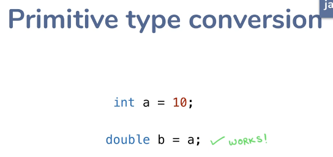
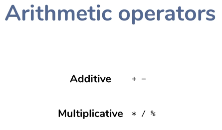
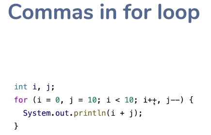
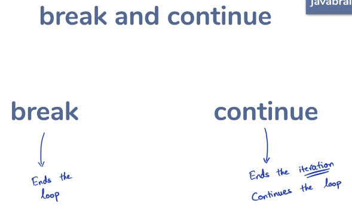
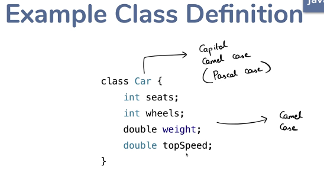
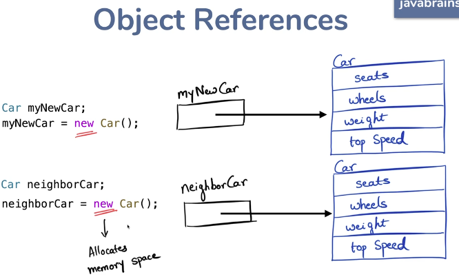
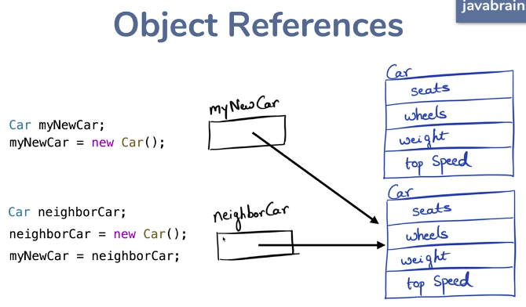
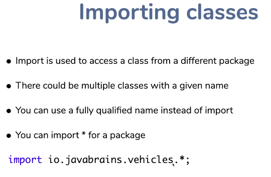

  

  

  

## Java - Platform Independent (WORA - Write Once Run Anywhere)

  

  

  

## JDK vs JRE vs JVM

  

  

  

  

## Advantage of this model 
- WORA, once you got the byte code, you can run it on any machine where the JRE/JVM is installed.
- Security, JVM acts as a Sandbox. JVM will not let you run anything

## JIT - Just In Time Compiler

  

## Five design goals of Java

  

## Compiling & Running a Java program without an IDE 

  

## JShell

  

## Disecting a Java Program

  

  

## Variable declaration and assignment

  

  

  

## Primitive types  

  

  

## Literals 
A way to specify value inline 
  

  

  

  

  

  

## Strong static typing
- Java is a strongly typed language

  

  

- What is static typing?

  

  

## Type casting
- Conversion in number types

  

  

  

  

  

  

## Casting and lossy conversion

  

- Casting object references(Covered later)

## Precision loss in numeric operations

  

## Automatic Type Promotion

  

 - What happens when one expression has multiple types?
 - Ans : Automatic type promotion

  

 - In an expression, if one int is present, every value will be converted to int
 - In an expression, if one long is present, every value will be converted to long
 - In an expression, if one double is present, every value will be converted to double

## Arrays

  

  

  

  

  

## Multidimensional Arrays

  

  

## Operators

  

  

  

  

  

  

  

  

## Blocks and Variable Scoping
- Curly braces forms a **Block**
- Local variables -> **Local** to scope  

  

  

## Flow/ Control Statements

  

  

  

  

  

  

  

  

  

  

  

  

  

  

  

  

  

  

  

## Revisiting variable scoping 

  

  

  

## Object Oriented Programming
 - Models **"things"** in the real or business world
 - State and Behavior
 - Objects - Referred to as instances or class instances

  

  

  

## Class Syntax and Object creation

  

  

  

  

  

## Object references

  

 - myNewCar, neighborCar are **Reference variables**

  

  

## Things to remember

  

  

## Variable Shadowing and this reference

  

- The **this** reference -> Refers to the instance the method will be run on.

  

## Constructors

  

  

  

  

## Calling a Constructor from Constructor

  

## Instance arguments and copy constructors

  

 - Instance variable can be references too. 

  

 - Method parameters/arguments can be reference variable too. 

## Constructor Object Argument

  

## Copy Constructor Pattern

  

 - Interview Question - What is a copy constructor?
 - Copy constructor is just one application of the constructor
 - For instance, you could pass the reference variable of different class and use one data member.

## Passing objects as method arguments

  

- Java has only call by value

  

  

  

## Packages

  

  

 - Let's say you have two packages, a.b and a.b.c, a.b.c doesn't belong to a.b. Both are two different packages.

  

## The Import statement
 - Import required to use a class from a different package. 
 - Or else you have to use Fully Qualified Name(packagename.ClassName)

  

  

## Access Modifiers
 - Encapsulate and restrict access to member variables and methods in Classes
 - What are the access modifiers in Java?

  

  

  

  

  

  

## The Static keyword
 - When you need to define a class member as independent from any object instance
 - Make a class member associate with the class, not instance.

  

  

  

  

  

  

  

## The final modifier

  

If we didn't initialize i variable, we can assign once. 

  

  

  

  

  

  

## Nested Classes 

### Static inner class

  

### Inner class 

  

### Local class 

  

### Anonymous inner class 

  

## Local classes and variable scope : 

  

  

  

  

## Inheritance and Polymorphism 

  

  

  

  

  

  

  

  

Why Java doesn't support Multiple Inheritance - Then it should handle so much complexities. One of many problem is Diamond Dependency Problem. 

  

 
  

  

  

## Method Overriding

  

  
This will not work. 

  

However, you can make it stronger. Protected -> Public is valid. 

  
Conveying our intent to the compiler! 

## Inheritance Example

  

  

## Encapsulation revisited

  
If run method uses seats, it will work in sub class as well.

  

  

## Constructors calls with Inheritance

  

B b = new B(); 
Output : 
A's constructor called
B's constructor called

  

  

B b = 
  new B(5); 
Output : 
A's constructor called
B's constructor called 5 

  

## Abstract Class

  

  

  

  

  

## Abstract Methods

  

  

## Final Keyword with Inheritance 

  

  

## Interfaces

  

  

  

## Usage of Interfaces

  

  

  

  

## Default Methods in Interfaces 

  

  

  

  

## Interfaces Summary 

  

  

## Polymorphism 
Means Many Forms

  

  

No need to create unnecessary methods

  

Instance move (Lion) move method will be called. 
You can only assign, child class object to parent class reference. Vice versa is not possible. 
You can't call Lion only methods, when you assign lion object to animal.

  

  

  

  

Lion's method will be called. 

## Polymorphism with interfaces 

  

  

Now using car, you can call only drive method, no matter how many methods present in SportsCar. 

## Casting 

  

  

  

## Is-A relationship 

  

  

Fish is a Animal
Bird is a Animal
Lion is a Animal

  

SportsCar is a Drivable car

## The Object class

  

  

  

  

## The toString method 

  

  

  

## The Equals method 

  

  

This is return false, even though all the member variable values are same. 

  

Still you can't use == , but rather you can use .equals method. 

  

  

## Exception Handling 

  

  

  

  

  

  

  

  

  

## Try Catch Block

  

  

## Execution flow in a Try-Catch block 

  

  

  

  

  

## Throw and the call stack 

  

  

  

  

## Exception Types and Hierarchies

  

Runtime Exception -> Unchecked exception 
Error -> Unchecked exception. 
Unchecked exception need not be surrounded by try catch block. 
But Exception needs to be surrounded by try catch block. 

## Custom Exception Classes 

  

  

  

  

  

## Throwable and Inherited Methods 

  

  

  

## Exception Handling Best Practices 

  

  

  
